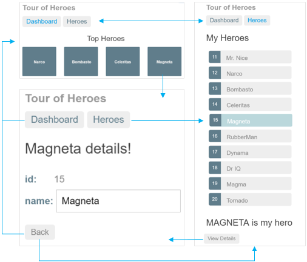

# Ng2TourOfHeros

This project was generated with [angular-cli](https://github.com/angular/angular-cli) version 1.0.0-beta.21.

#### create Hero class

```
$ ng g cl hero
installing class
  create src/app/hero.ts
```

#### Tour of Heroes navigation



Here is the plan:

* turn `AppComponent` into an application shell that only handles navigation

  our current app loads `AppComponent` and immediately displays the list of heroes.
  the revised app should present a shell with a choice of views 
  (Dashboard and Heroes) and then default to one of them.
  

* Relocate the `Heroes` concerns within the current `AppComponent` to a separate
  `HeroesComponent`
* Add routing
* Create a new `DashBoardComponent`
* Tie the `Dashboard` into the nav structure  


## Development server
Run `ng serve` for a dev server. Navigate to `http://localhost:4200/`. The app will automatically reload if you change any of the source files.

## Code scaffolding

Run `ng generate component component-name` to generate a new component. You can also use `ng generate directive/pipe/service/class`.

## Build

Run `ng build` to build the project. The build artifacts will be stored in the `dist/` directory. Use the `-prod` flag for a production build.

## Running unit tests

Run `ng test` to execute the unit tests via [Karma](https://karma-runner.github.io).

## Running end-to-end tests

Run `ng e2e` to execute the end-to-end tests via [Protractor](http://www.protractortest.org/).
Before running the tests make sure you are serving the app via `ng serve`.

## Deploying to Github Pages

Run `ng github-pages:deploy` to deploy to Github Pages.

## Further help

To get more help on the `angular-cli` use `ng --help` or go check out the [Angular-CLI README](https://github.com/angular/angular-cli/blob/master/README.md).
